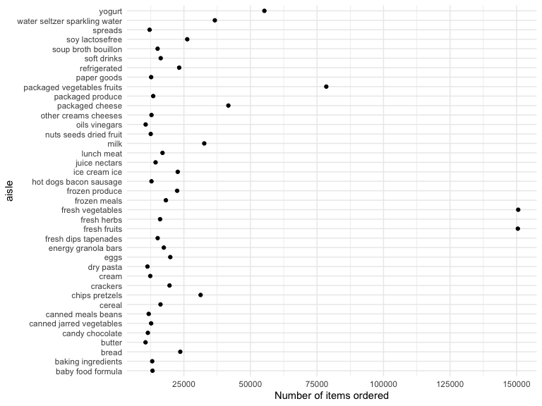

p8105\_hw3\_cm3928
================
Clement Mugenzi
10/3/2019

# Question 1

``` r
library(p8105.datasets)
data(instacart)
janitor::clean_names(instacart)
```

    ## # A tibble: 1,384,617 x 15
    ##    order_id product_id add_to_cart_ord… reordered user_id eval_set
    ##       <int>      <int>            <int>     <int>   <int> <chr>   
    ##  1        1      49302                1         1  112108 train   
    ##  2        1      11109                2         1  112108 train   
    ##  3        1      10246                3         0  112108 train   
    ##  4        1      49683                4         0  112108 train   
    ##  5        1      43633                5         1  112108 train   
    ##  6        1      13176                6         0  112108 train   
    ##  7        1      47209                7         0  112108 train   
    ##  8        1      22035                8         1  112108 train   
    ##  9       36      39612                1         0   79431 train   
    ## 10       36      19660                2         1   79431 train   
    ## # … with 1,384,607 more rows, and 9 more variables: order_number <int>,
    ## #   order_dow <int>, order_hour_of_day <int>,
    ## #   days_since_prior_order <int>, product_name <chr>, aisle_id <int>,
    ## #   department_id <int>, aisle <chr>, department <chr>

## A brief description of the dataset

The instacart dataset is comprised of **15** variables and **1384617**
observations.

\*\* I am going to group\_by and summarize character variables.

``` r
doyou = 
  instacart %>% 
  group_by(product_name, department) %>% 
  summarise(n = n())
view(doyou)
```

**How many aisles are there, and which aisles are the most items ordered
from?**

``` r
num_aisle = 
  instacart %>% 
  count(aisle) %>% 
  summarise(n = n())
num_aisle
```

    ## # A tibble: 1 x 1
    ##       n
    ##   <int>
    ## 1   134

``` r
items_ord = 
  instacart %>% 
  group_by(aisle) %>% 
  summarize(items_ordered = n()) %>% 
  arrange(-items_ordered)
view(items_ord)
```

``` r
kable(items_ord, markdown)
```

|             aisle             | items\_ordered |
| :---------------------------: | :------------: |
|       fresh vegetables        |     150609     |
|         fresh fruits          |     150473     |
|  packaged vegetables fruits   |     78493      |
|            yogurt             |     55240      |
|        packaged cheese        |     41699      |
| water seltzer sparkling water |     36617      |
|             milk              |     32644      |
|        chips pretzels         |     31269      |
|        soy lactosefree        |     26240      |
|             bread             |     23635      |
|         refrigerated          |     23228      |
|         ice cream ice         |     22676      |
|        frozen produce         |     22453      |
|             eggs              |     19875      |
|           crackers            |     19592      |
|         frozen meals          |     18221      |
|      energy granola bars      |     17449      |
|          lunch meat           |     16957      |
|          soft drinks          |     16279      |
|            cereal             |     16201      |
|          fresh herbs          |     16052      |
|     fresh dips tapenades      |     15142      |
|      soup broth bouillon      |     15109      |
|         juice nectars         |     14350      |
|       packaged produce        |     13460      |
|       baby food formula       |     13198      |
|      baking ingredients       |     13088      |
|     other creams cheeses      |     12820      |
|    hot dogs bacon sausage     |     12813      |
|          paper goods          |     12694      |
|   canned jarred vegetables    |     12679      |
|    nuts seeds dried fruit     |     12532      |
|             cream             |     12356      |
|            spreads            |     12102      |
|      canned meals beans       |     11774      |
|        candy chocolate        |     11453      |
|           dry pasta           |     11298      |
|         oils vinegars         |     10620      |
|            butter             |     10575      |
|         cookies cakes         |      9980      |
|         instant foods         |      9917      |
|       breakfast bakery        |      9851      |
|          condiments           |      9743      |
|          pasta sauce          |      9736      |
|       frozen breakfast        |      9729      |
|              tea              |      9376      |
|       spices seasonings       |      9279      |
|    frozen appetizers sides    |      8870      |
|            coffee             |      8392      |
|     tortillas flat bread      |      8353      |
|            missing            |      8251      |
|         frozen pizza          |      7661      |
|          asian foods          |      7007      |
|         popcorn jerky         |      6917      |
|    fruit vegetable snacks     |      6741      |
|   hot cereal pancake mixes    |      6352      |
|    grains rice dried goods    |      6134      |
|       cleaning products       |      5894      |
|       packaged poultry        |      5608      |
|        poultry counter        |      5208      |
|    preserved dips spreads     |      5188      |
|    tofu meat alternatives     |      5123      |
|          buns rolls           |      5054      |
|     pickled goods olives      |      4882      |
|  doughs gelatins bake mixes   |      4758      |
|     energy sports drinks      |      4742      |
|    frozen vegan vegetarian    |      4727      |
|    salad dressing toppings    |      4719      |
|            laundry            |      4636      |
|        prepared meals         |      4133      |
|    canned fruit applesauce    |      3996      |
|       specialty cheeses       |      3873      |
|        dish detergents        |      3870      |
|            granola            |      3803      |
|         latino foods          |      3548      |
|      frozen meat seafood      |      3341      |
|      canned meat seafood      |      3241      |
|         meat counter          |      3159      |
|    breakfast bars pastries    |      3144      |
|         oral hygiene          |      3070      |
|     prepared soups salads     |      2936      |
|         food storage          |      2906      |
|  marinades meat preparation   |      2905      |
|         cat food care         |      2885      |
|     honeys syrups nectars     |      2864      |
|             soap              |      2773      |
|       body lotions soap       |      2137      |
|     vitamins supplements      |      1969      |
|  plates bowls cups flatware   |      1959      |
|         beers coolers         |      1839      |
|             other             |      1795      |
| refrigerated pudding desserts |      1729      |
|          fresh pasta          |      1628      |
|       trash bags liners       |      1621      |
|         dog food care         |      1612      |
|   protein meal replacements   |      1612      |
|     frozen breads doughs      |      1532      |
|         packaged meat         |      1526      |
|        bakery desserts        |      1501      |
|           hair care           |      1469      |
|      trail mix snack mix      |      1463      |
|       cold flu allergy        |      1346      |
|           red wines           |      1243      |
|           digestion           |      1205      |
|         diapers wipes         |      1109      |
|     baking supplies decor     |      1094      |
|          white wines          |      1088      |
|        seafood counter        |      1084      |
|    air fresheners candles     |      1067      |
|       cocoa drink mixes       |      1062      |
|         feminine care         |      1048      |
|            spirits            |      967       |
|           mint gum            |      962       |
|        frozen dessert         |      922       |
|       packaged seafood        |      909       |
|  muscles joints pain relief   |      897       |
|        more household         |      891       |
|          deodorants           |      858       |
|          facial care          |      746       |
| bulk dried fruits vegetables  |      725       |
|         indian foods          |      719       |
| bulk grains rice dried goods  |      634       |
|         kosher foods          |      628       |
|         eye ear care          |      548       |
|           first aid           |      539       |
|           skin care           |      534       |
|          shave needs          |      532       |
|      ice cream toppings       |      504       |
|  specialty wines champagnes   |      461       |
|       kitchen supplies        |      448       |
|      baby bath body care      |      328       |
|       baby accessories        |      306       |
|         frozen juice          |      294       |
|            beauty             |      287       |

There are 134 aisles and fresh vegetables is the most popular aisle with
150609 items ordered from it.

**Make a plot that shows the number of items ordered in each aisle,
limiting this to aisles with more than 10000 items ordered. Arrange
aisles sensibly, and organize your plot so others can read it.**

``` r
plot = 
  items_ord %>%
  filter(items_ordered > 10000) %>% 
  ggplot(aes(x = items_ordered, y = aisle)) + 
  geom_point() +
  labs(
     x = "Number of items ordered") +
  scale_x_continuous(
    breaks = c(25000, 50000, 75000, 100000, 125000, 150000)
  )
plot
```



**Make a table showing the three most popular items in each of the
aisles “baking ingredients”, “dog food care”, and “packaged vegetables
fruits”. Include the number of times each item is ordered in your
table.**

``` r
tab = 
  instacart %>% 
  group_by(aisle, product_name) %>% 
  filter(min_rank(desc(order_id)) < 4) %>% 
  select(-c(product_id:days_since_prior_order), 
         -department_id, -aisle_id) %>% 
  summarise(order_id = n()) %>%
  filter(aisle == c("baking ingredients", "dog food care", 
                    "packaged vegetable fruits"))
view(tab)
```

**Make a table showing the mean hour of the day at which Pink Lady
Apples and Coffee Ice Cream are ordered on each day of the week; format
this table for human readers (i.e. produce a 2 x 7 table).**

``` r
  instacart %>% 
  filter(product_name == c("Pink Lady Apples", "Coffee Ice Cream")) %>%
  group_by(order_dow, product_name) %>%
  summarise(
    mean_hour = mean(order_hour_of_day)) %>% 
  pivot_wider(
    names_from = order_dow,
    values_from = mean_hour) %>% 
knitr::kable(digits = 0)
```

| product\_name    |  0 |  1 |  2 |  3 |  4 |  5 |  6 |
| :--------------- | -: | -: | -: | -: | -: | -: | -: |
| Coffee Ice Cream | 13 | 15 | 15 | 15 | 15 | 10 | 12 |
| Pink Lady Apples | 12 | 12 | 12 | 14 | 12 | 14 | 12 |

# Question 2

First, let’s read in the dataset.

``` r
library(p8105.datasets)
data(brfss_smart2010)
```

**Cleaning the dataset**

**First, do some data cleaning:**

**format the data to use appropriate variable names;** **focus on the
“Overall Health” topic** **include only responses from “Excellent” to
“Poor”** **organize responses as a factor taking levels ordered from
“Poor” to “Excellent”**

I also renamed the **locationabbr** to **states.** and **locationdesc**
to **counties.**

``` r
new_brfss_smart2010 = 
  brfss_smart2010 %>% 
  janitor::clean_names() %>%
  rename(states = "locationabbr", counties = "locationdesc") %>% 
  filter(topic == "Overall Health", 
         response == c("Poor", "Fair or Poor Health", "Fair",
                       "Good or Better Health", "Good",
                       "Very Good", "Excellent"))
view(new_brfss_smart2010)
```

``` r
what_states_02 = 
  new_brfss_smart2010 %>% 
  mutate(
    pop_02 = case_when(
      counties >= 7 ~ "popular_02")) %>% 
  filter(year == "2002") %>% 
  janitor::tabyl(states, pop_02)
what_states_02
```

    ##  states popular_02
    ##      AK          1
    ##      AL          1
    ##      AR          1
    ##      AZ          2
    ##      CA          1
    ##      CO          1
    ##      CT          6
    ##      DC          1
    ##      DE          3
    ##      FL          6
    ##      GA          1
    ##      IA          1
    ##      KS          1
    ##      KY          1
    ##      MA          3
    ##      MD          5
    ##      MI          3
    ##      MN          2
    ##      MO          2
    ##      MS          1
    ##      NC          4
    ##      ND          1
    ##      NE          2
    ##      NH          2
    ##      NJ          2
    ##      NM          2
    ##      NV          1
    ##      NY          4
    ##      OK          1
    ##      OR          2
    ##      PA          3
    ##      SC          1
    ##      TX          1
    ##      UT          3
    ##      VT          1
    ##      WA          8
    ##      WI          2
    ##      WV          2

The state that was observed at 7 or more locations in the year 2002 was:
**Washington State.**

``` r
what_states_10 = 
  new_brfss_smart2010 %>% 
  mutate(
    pop_10 = case_when(
      counties >= 7 ~ "popular_10")) %>% 
  filter(year == "2010") %>% 
  janitor::tabyl(states, pop_10)
what_states_10
```

    ##  states popular_10
    ##      AL          1
    ##      AR          1
    ##      CA          5
    ##      CO          7
    ##      CT          3
    ##      DE          1
    ##      FL         24
    ##      GA          3
    ##      IA          2
    ##      ID          2
    ##      KS          1
    ##      LA          3
    ##      MA          7
    ##      MD         11
    ##      ME          6
    ##      MI          4
    ##      MN          4
    ##      MO          2
    ##      MS          2
    ##      MT          3
    ##      NC          5
    ##      NE          5
    ##      NH          3
    ##      NJ          6
    ##      NM          1
    ##      NV          1
    ##      NY          4
    ##      OH          5
    ##      OK          4
    ##      OR          3
    ##      PA          5
    ##      RI          2
    ##      SC          5
    ##      TN          2
    ##      TX          9
    ##      UT          4
    ##      VT          7
    ##      WA          7
    ##      WI          2
    ##      WY          1

States that were observed at 7 or more locations in the year 2010 were:
**Colorado, Florida, Massachusetts, Maryland, Texas, Vermont,
Washington.**

Construct a dataset that is limited to Excellent responses, and
contains, year, state, and a variable that averages the data\_value
across locations within a state.

``` r
spaghetti_df = 
  new_brfss_smart2010 %>%
  group_by(year) %>% 
  filter(response == "Excellent") %>%
  mutate(
    mean_value = mean(data_value, na.rm = T)) %>%
  select(year, states, mean_value)
```

``` r
kable(spaghetti_df, markdown)
```

| year | states | mean\_value |
| :--: | :----: | :---------: |
| 2010 |   CA   |  22.15366   |
| 2010 |   CO   |  22.15366   |
| 2010 |   CO   |  22.15366   |
| 2010 |   CO   |  22.15366   |
| 2010 |   FL   |  22.15366   |
| 2010 |   FL   |  22.15366   |
| 2010 |   FL   |  22.15366   |
| 2010 |   FL   |  22.15366   |
| 2010 |   FL   |  22.15366   |
| 2010 |   GA   |  22.15366   |
| 2010 |   IA   |  22.15366   |
| 2010 |   LA   |  22.15366   |
| 2010 |   ME   |  22.15366   |
| 2010 |   ME   |  22.15366   |
| 2010 |   MD   |  22.15366   |
| 2010 |   MD   |  22.15366   |
| 2010 |   MD   |  22.15366   |
| 2010 |   MA   |  22.15366   |
| 2010 |   MA   |  22.15366   |
| 2010 |   MI   |  22.15366   |
| 2010 |   MI   |  22.15366   |
| 2010 |   MN   |  22.15366   |
| 2010 |   MS   |  22.15366   |
| 2010 |   MO   |  22.15366   |
| 2010 |   MT   |  22.15366   |
| 2010 |   NE   |  22.15366   |
| 2010 |   NJ   |  22.15366   |
| 2010 |   NY   |  22.15366   |
| 2010 |   OH   |  22.15366   |
| 2010 |   OK   |  22.15366   |
| 2010 |   OR   |  22.15366   |
| 2010 |   PA   |  22.15366   |
| 2010 |   SC   |  22.15366   |
| 2010 |   TX   |  22.15366   |
| 2010 |   TX   |  22.15366   |
| 2010 |   TX   |  22.15366   |
| 2010 |   UT   |  22.15366   |
| 2010 |   UT   |  22.15366   |
| 2010 |   VT   |  22.15366   |
| 2010 |   VT   |  22.15366   |
| 2010 |   WA   |  22.15366   |
| 2010 |   WA   |  22.15366   |
| 2009 |   AK   |  20.96383   |
| 2009 |   AZ   |  20.96383   |
| 2009 |   CA   |  20.96383   |
| 2009 |   CA   |  20.96383   |
| 2009 |   CA   |  20.96383   |
| 2009 |   CA   |  20.96383   |
| 2009 |   CA   |  20.96383   |
| 2009 |   CO   |  20.96383   |
| 2009 |   GA   |  20.96383   |
| 2009 |   HI   |  20.96383   |
| 2009 |   IL   |  20.96383   |
| 2009 |   KS   |  20.96383   |
| 2009 |   KS   |  20.96383   |
| 2009 |   KS   |  20.96383   |
| 2009 |   LA   |  20.96383   |
| 2009 |   LA   |  20.96383   |
| 2009 |   LA   |  20.96383   |
| 2009 |   ME   |  20.96383   |
| 2009 |   MD   |  20.96383   |
| 2009 |   MA   |  20.96383   |
| 2009 |   MI   |  20.96383   |
| 2009 |   MS   |  20.96383   |
| 2009 |   MS   |  20.96383   |
| 2009 |   MS   |  20.96383   |
| 2009 |   MO   |  20.96383   |
| 2009 |   NE   |  20.96383   |
| 2009 |   NE   |  20.96383   |
| 2009 |   NE   |  20.96383   |
| 2009 |   NJ   |  20.96383   |
| 2009 |   NJ   |  20.96383   |
| 2009 |   NM   |  20.96383   |
| 2009 |   NM   |  20.96383   |
| 2009 |   NM   |  20.96383   |
| 2009 |   NY   |  20.96383   |
| 2009 |   NC   |  20.96383   |
| 2009 |   ND   |  20.96383   |
| 2009 |   ND   |  20.96383   |
| 2009 |   OH   |  20.96383   |
| 2009 |   OR   |  20.96383   |
| 2009 |   SC   |  20.96383   |
| 2009 |   SC   |  20.96383   |
| 2009 |   TX   |  20.96383   |
| 2009 |   UT   |  20.96383   |
| 2009 |   UT   |  20.96383   |
| 2009 |   VT   |  20.96383   |
| 2009 |   WA   |  20.96383   |
| 2009 |   WA   |  20.96383   |
| 2008 |   AZ   |  22.50882   |
| 2008 |   AR   |  22.50882   |
| 2008 |   CA   |  22.50882   |
| 2008 |   CO   |  22.50882   |
| 2008 |   CO   |  22.50882   |
| 2008 |   FL   |  22.50882   |
| 2008 |   FL   |  22.50882   |
| 2008 |   HI   |  22.50882   |
| 2008 |   ID   |  22.50882   |
| 2008 |   IL   |  22.50882   |
| 2008 |   IA   |  22.50882   |
| 2008 |   KS   |  22.50882   |
| 2008 |   ME   |  22.50882   |
| 2008 |   ME   |  22.50882   |
| 2008 |   MA   |  22.50882   |
| 2008 |   MA   |  22.50882   |
| 2008 |   MA   |  22.50882   |
| 2008 |   MA   |  22.50882   |
| 2008 |   MT   |  22.50882   |
| 2008 |   NE   |  22.50882   |
| 2008 |   NE   |  22.50882   |
| 2008 |   NV   |  22.50882   |
| 2008 |   NJ   |  22.50882   |
| 2008 |   NY   |  22.50882   |
| 2008 |   NY   |  22.50882   |
| 2008 |   OK   |  22.50882   |
| 2008 |   PA   |  22.50882   |
| 2008 |   RI   |  22.50882   |
| 2008 |   RI   |  22.50882   |
| 2008 |   TN   |  22.50882   |
| 2008 |   UT   |  22.50882   |
| 2008 |   VT   |  22.50882   |
| 2008 |   WA   |  22.50882   |
| 2008 |   WY   |  22.50882   |
| 2007 |   CA   |  22.77179   |
| 2007 |   CA   |  22.77179   |
| 2007 |   CO   |  22.77179   |
| 2007 |   DC   |  22.77179   |
| 2007 |   FL   |  22.77179   |
| 2007 |   FL   |  22.77179   |
| 2007 |   FL   |  22.77179   |
| 2007 |   FL   |  22.77179   |
| 2007 |   FL   |  22.77179   |
| 2007 |   FL   |  22.77179   |
| 2007 |   FL   |  22.77179   |
| 2007 |   HI   |  22.77179   |
| 2007 |   IL   |  22.77179   |
| 2007 |   KS   |  22.77179   |
| 2007 |   MD   |  22.77179   |
| 2007 |   MD   |  22.77179   |
| 2007 |   MD   |  22.77179   |
| 2007 |   MD   |  22.77179   |
| 2007 |   MA   |  22.77179   |
| 2007 |   MA   |  22.77179   |
| 2007 |   MA   |  22.77179   |
| 2007 |   MS   |  22.77179   |
| 2007 |   NE   |  22.77179   |
| 2007 |   NH   |  22.77179   |
| 2007 |   NJ   |  22.77179   |
| 2007 |   NJ   |  22.77179   |
| 2007 |   NY   |  22.77179   |
| 2007 |   NC   |  22.77179   |
| 2007 |   OH   |  22.77179   |
| 2007 |   OH   |  22.77179   |
| 2007 |   PA   |  22.77179   |
| 2007 |   SC   |  22.77179   |
| 2007 |   SC   |  22.77179   |
| 2007 |   TX   |  22.77179   |
| 2007 |   UT   |  22.77179   |
| 2007 |   VT   |  22.77179   |
| 2007 |   VA   |  22.77179   |
| 2007 |   WA   |  22.77179   |
| 2007 |   WY   |  22.77179   |
| 2006 |   AZ   |  22.87187   |
| 2006 |   CO   |  22.87187   |
| 2006 |   CT   |  22.87187   |
| 2006 |   CT   |  22.87187   |
| 2006 |   DE   |  22.87187   |
| 2006 |   FL   |  22.87187   |
| 2006 |   GA   |  22.87187   |
| 2006 |   ID   |  22.87187   |
| 2006 |   KS   |  22.87187   |
| 2006 |   LA   |  22.87187   |
| 2006 |   LA   |  22.87187   |
| 2006 |   MD   |  22.87187   |
| 2006 |   MD   |  22.87187   |
| 2006 |   MA   |  22.87187   |
| 2006 |   MN   |  22.87187   |
| 2006 |   MT   |  22.87187   |
| 2006 |   NV   |  22.87187   |
| 2006 |   NH   |  22.87187   |
| 2006 |   NH   |  22.87187   |
| 2006 |   NJ   |  22.87187   |
| 2006 |   NJ   |  22.87187   |
| 2006 |   NM   |  22.87187   |
| 2006 |   NC   |  22.87187   |
| 2006 |   NC   |  22.87187   |
| 2006 |   NC   |  22.87187   |
| 2006 |   ND   |  22.87187   |
| 2006 |   OH   |  22.87187   |
| 2006 |   OR   |  22.87187   |
| 2006 |   PA   |  22.87187   |
| 2006 |   SD   |  22.87187   |
| 2006 |   TX   |  22.87187   |
| 2006 |   VT   |  22.87187   |
| 2006 |   WV   |  22.87187   |
| 2005 |   AK   |  21.85366   |
| 2005 |   AK   |  21.85366   |
| 2005 |   AR   |  21.85366   |
| 2005 |   AR   |  21.85366   |
| 2005 |   CO   |  21.85366   |
| 2005 |   CT   |  21.85366   |
| 2005 |   CT   |  21.85366   |
| 2005 |   DE   |  21.85366   |
| 2005 |   FL   |  21.85366   |
| 2005 |   IL   |  21.85366   |
| 2005 |   IN   |  21.85366   |
| 2005 |   MD   |  21.85366   |
| 2005 |   MI   |  21.85366   |
| 2005 |   MN   |  21.85366   |
| 2005 |   NE   |  21.85366   |
| 2005 |   NV   |  21.85366   |
| 2005 |   NH   |  21.85366   |
| 2005 |   NJ   |  21.85366   |
| 2005 |   NJ   |  21.85366   |
| 2005 |   NJ   |  21.85366   |
| 2005 |   NJ   |  21.85366   |
| 2005 |   NJ   |  21.85366   |
| 2005 |   NM   |  21.85366   |
| 2005 |   NY   |  21.85366   |
| 2005 |   NY   |  21.85366   |
| 2005 |   NC   |  21.85366   |
| 2005 |   NC   |  21.85366   |
| 2005 |   OH   |  21.85366   |
| 2005 |   OK   |  21.85366   |
| 2005 |   OK   |  21.85366   |
| 2005 |   OR   |  21.85366   |
| 2005 |   OR   |  21.85366   |
| 2005 |   OR   |  21.85366   |
| 2005 |   PA   |  21.85366   |
| 2005 |   PA   |  21.85366   |
| 2005 |   PA   |  21.85366   |
| 2005 |   RI   |  21.85366   |
| 2005 |   RI   |  21.85366   |
| 2005 |   TN   |  21.85366   |
| 2005 |   UT   |  21.85366   |
| 2005 |   VT   |  21.85366   |
| 2004 |   AZ   |  22.00976   |
| 2004 |   CO   |  22.00976   |
| 2004 |   CT   |  22.00976   |
| 2004 |   CT   |  22.00976   |
| 2004 |   DE   |  22.00976   |
| 2004 |   FL   |  22.00976   |
| 2004 |   FL   |  22.00976   |
| 2004 |   ME   |  22.00976   |
| 2004 |   MD   |  22.00976   |
| 2004 |   MA   |  22.00976   |
| 2004 |   MA   |  22.00976   |
| 2004 |   MI   |  22.00976   |
| 2004 |   MS   |  22.00976   |
| 2004 |   MN   |  22.00976   |
| 2004 |   MO   |  22.00976   |
| 2004 |   NE   |  22.00976   |
| 2004 |   NE   |  22.00976   |
| 2004 |   NV   |  22.00976   |
| 2004 |   NJ   |  22.00976   |
| 2004 |   NJ   |  22.00976   |
| 2004 |   NJ   |  22.00976   |
| 2004 |   NJ   |  22.00976   |
| 2004 |   NJ   |  22.00976   |
| 2004 |   NY   |  22.00976   |
| 2004 |   NY   |  22.00976   |
| 2004 |   NC   |  22.00976   |
| 2004 |   NC   |  22.00976   |
| 2004 |   ND   |  22.00976   |
| 2004 |   OH   |  22.00976   |
| 2004 |   OK   |  22.00976   |
| 2004 |   OR   |  22.00976   |
| 2004 |   OR   |  22.00976   |
| 2004 |   RI   |  22.00976   |
| 2004 |   SD   |  22.00976   |
| 2004 |   WA   |  22.00976   |
| 2004 |   TN   |  22.00976   |
| 2004 |   TX   |  22.00976   |
| 2004 |   UT   |  22.00976   |
| 2004 |   VT   |  22.00976   |
| 2004 |   VT   |  22.00976   |
| 2004 |   WA   |  22.00976   |
| 2003 |   NH   |  19.25000   |
| 2003 |   NY   |  19.25000   |
| 2002 |   MD   |  21.36923   |
| 2002 |   MD   |  21.36923   |
| 2002 |   MD   |  21.36923   |
| 2002 |   NM   |  21.36923   |
| 2002 |   NY   |  21.36923   |
| 2002 |   NY   |  21.36923   |
| 2002 |   TX   |  21.36923   |
| 2002 |   WA   |  21.36923   |
| 2002 |   WA   |  21.36923   |
| 2002 |   WA   |  21.36923   |
| 2002 |   WA   |  21.36923   |
| 2002 |   WV   |  21.36923   |
| 2002 |   WI   |  21.36923   |

Make a “spaghetti” plot of this average value over time within a state
(that is, make a plot showing a line for each state across years – the
geom\_line geometry and group aesthetic will help).

``` r
spaghetti_plot = 
  spaghetti_df %>%
  ggplot(aes(x = year, y = mean_value, color = year)) +
  geom_line()
spaghetti_plot
```


