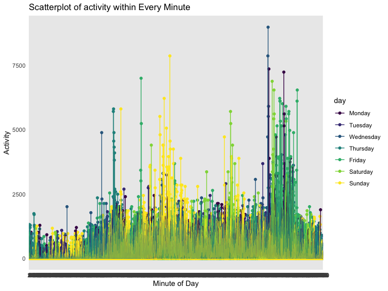

p8105\_hw3\_cm3928
================
Clement Mugenzi
10/3/2019

# Question 1

``` r
library(p8105.datasets)
data(instacart)
janitor::clean_names(instacart)
```

    ## # A tibble: 1,384,617 x 15
    ##    order_id product_id add_to_cart_ord… reordered user_id eval_set
    ##       <int>      <int>            <int>     <int>   <int> <chr>   
    ##  1        1      49302                1         1  112108 train   
    ##  2        1      11109                2         1  112108 train   
    ##  3        1      10246                3         0  112108 train   
    ##  4        1      49683                4         0  112108 train   
    ##  5        1      43633                5         1  112108 train   
    ##  6        1      13176                6         0  112108 train   
    ##  7        1      47209                7         0  112108 train   
    ##  8        1      22035                8         1  112108 train   
    ##  9       36      39612                1         0   79431 train   
    ## 10       36      19660                2         1   79431 train   
    ## # … with 1,384,607 more rows, and 9 more variables: order_number <int>,
    ## #   order_dow <int>, order_hour_of_day <int>,
    ## #   days_since_prior_order <int>, product_name <chr>, aisle_id <int>,
    ## #   department_id <int>, aisle <chr>, department <chr>

## A brief description of the dataset

The instacart dataset is comprised of **15** variables and **1384617**
observations. There are few important variables worth noting such as
**aisle** wich represents the name of different aisles,
**product\_name** which is different names of products in the aisles,
etc. Every observation in each row is a product from an order and there
is a single order per user.

## a.

**How many aisles are there, and which aisles are the most items ordered
from?**

``` r
num_aisle = 
  instacart %>% 
  count(aisle) %>% 
  summarise(n = n())
num_aisle
```

    ## # A tibble: 1 x 1
    ##       n
    ##   <int>
    ## 1   134

``` r
items_ord = 
  instacart %>% 
  group_by(aisle) %>% 
  summarize(items_ordered = n()) %>% 
  arrange(-items_ordered)
```

``` r
kable(head(items_ord), markdown)
```

|             aisle             | items\_ordered |
| :---------------------------: | :------------: |
|       fresh vegetables        |     150609     |
|         fresh fruits          |     150473     |
|  packaged vegetables fruits   |     78493      |
|            yogurt             |     55240      |
|        packaged cheese        |     41699      |
| water seltzer sparkling water |     36617      |

There are **134** aisles and **fresh vegetables** is the most popular
aisle with **150609** items ordered from it.

## b.

**Make a plot that shows the number of items ordered in each aisle,
limiting this to aisles with more than 10000 items ordered. Arrange
aisles sensibly, and organize your plot so others can read it.**

``` r
  items_ord %>%
  filter(items_ordered > 10000) %>% 
  mutate(
    aisle = fct_reorder(aisle, items_ordered)) %>% 
  ggplot(aes(x = items_ordered, y = aisle)) + 
  geom_point(aes(color = aisle)) +
  labs(
    title = "Number of items ordered per aisle",
    x = "Number of items ordered",
    y = "Aisle") +
  scale_x_continuous(
    breaks = c(25000, 75000, 150000))
```


The resulting scatterplot shows an exponential increase in orders when
aisles are ordered according to how popular they are with **fresh
vegetables** and **fresh fruits** being the outliers with far more
orders made from those two aisles. This is a sign that the community in
which the grocery store is located is big on eating a healthy diet.

## c.

**Make a table showing the three most popular items in each of the
aisles “baking ingredients”, “dog food care”, and “packaged vegetables
fruits”. Include the number of times each item is ordered in your
table.**

``` r
  instacart %>% 
  filter(aisle %in% c("baking ingredients", "dog food care", 
                    "packaged vegetables fruits")) %>%
  select(-c(product_id:days_since_prior_order), 
         -department_id, -aisle_id, -department) %>% 
  group_by(aisle, product_name) %>% 
  summarise(order_id = n()) %>% 
  filter(min_rank(desc(order_id)) < 4) %>% 
  arrange(desc(order_id)) %>% 
  knitr::kable()
```

| aisle                      | product\_name                                 | order\_id |
| :------------------------- | :-------------------------------------------- | --------: |
| packaged vegetables fruits | Organic Baby Spinach                          |      9784 |
| packaged vegetables fruits | Organic Raspberries                           |      5546 |
| packaged vegetables fruits | Organic Blueberries                           |      4966 |
| baking ingredients         | Light Brown Sugar                             |       499 |
| baking ingredients         | Pure Baking Soda                              |       387 |
| baking ingredients         | Cane Sugar                                    |       336 |
| dog food care              | Snack Sticks Chicken & Rice Recipe Dog Treats |        30 |
| dog food care              | Organix Chicken & Brown Rice Recipe           |        28 |
| dog food care              | Small Dog Biscuits                            |        26 |

The top selling products in aisles **packaged vegetables Fruits**,
**baking ingredients**, **dog food care** are **organic baby spinach**,
**light brown sugar**, and **snack sticks chicken & rice recipe dog
treats** respectively.

## d.

**Make a table showing the mean hour of the day at which Pink Lady
Apples and Coffee Ice Cream are ordered on each day of the week; format
this table for human readers (i.e. produce a 2 x 7 table).**

``` r
  instacart %>% 
  mutate(
    order_dow = recode(order_dow, "0" = "Sunday", "1" = "Monday", 
                       "2" = "Tuesday", "3" = "Wednesday", 
                       "4" = "Thursday", "5" = "Friday", 
                       "6" = "Saturday"), 
    order_dow = factor(order_dow, levels = c("Monday", "Tuesday", 
                                             "Wednesday", "Thursday", 
                                             "Friday", "Saturday",
                                             "Sunday"))) %>% 
  arrange(order_dow) %>% 
  filter(product_name == c("Pink Lady Apples", "Coffee Ice Cream")) %>%
  group_by(order_dow, product_name) %>%
  summarise(
    mean_hour = mean(order_hour_of_day)) %>% 
  pivot_wider(
    names_from = order_dow,
    values_from = mean_hour) %>% 
knitr::kable(digits = 1)
```

| product\_name    | Monday | Tuesday | Wednesday | Thursday | Friday | Saturday | Sunday |
| :--------------- | -----: | ------: | --------: | -------: | -----: | -------: | -----: |
| Coffee Ice Cream |   15.0 |    15.3 |      14.0 |     13.6 |   13.5 |     14.4 |   13.7 |
| Pink Lady Apples |   11.5 |    10.7 |      14.5 |     11.1 |   11.9 |     11.7 |   12.7 |

Based on this table, it looks like **Coffee Ice Cream** is mostly
ordered around **3pm** on average whereas **Pink Lady Apples** is mostly
ordered around **11am**, close to lunch hours.

# Question 2

``` r
library(p8105.datasets)
data(brfss_smart2010)
```

## a.

I renamed the **locationabbr** to **states.** and **locationdesc** to
**counties.**

I used **mutate** to change the response variable to a factor variable
so I can be able to arrange from **Poor** to **Excellent.**

``` r
new_brfss_smart2010 = 
  brfss_smart2010 %>% 
  janitor::clean_names() %>% 
  rename(states = "locationabbr", counties = "locationdesc") %>% 
  filter(topic == "Overall Health", 
         response %in% c("Poor", "Fair","Good",
                       "Very good", "Excellent")) %>%
    mutate(response = factor(response, levels = c("Poor", "Fair","Good",
                       "Very good", "Excellent"))) %>% 
  arrange(response)
```

## a.

**In 2002, which states were observed at 7 or more locations? What about
in 2010?**

``` r
  new_brfss_smart2010 %>%
  filter(year == "2002") %>%
  group_by(states) %>%
  distinct(counties) %>%
  summarise(
    location_02 = n()
  ) %>%
  filter(location_02 >= 7) %>% 
  knitr::kable()
```

| states | location\_02 |
| :----- | -----------: |
| CT     |            7 |
| FL     |            7 |
| MA     |            8 |
| NC     |            7 |
| NJ     |            8 |
| PA     |           10 |

The states that were observed at 7 or more locations in the year 2002
was: **Connecticut, Florida, Massachusetts, North Carolina, New Jersey,
and Pennsylvania.**

``` r
  new_brfss_smart2010 %>%
  filter(year == "2010") %>%
  group_by(states) %>%
  distinct(counties) %>%
  summarise(
    location_10 = n()
  ) %>%
  filter(location_10 >= 7) %>% 
  knitr::kable()
```

| states | location\_10 |
| :----- | -----------: |
| CA     |           12 |
| CO     |            7 |
| FL     |           41 |
| MA     |            9 |
| MD     |           12 |
| NC     |           12 |
| NE     |           10 |
| NJ     |           19 |
| NY     |            9 |
| OH     |            8 |
| PA     |            7 |
| SC     |            7 |
| TX     |           16 |
| WA     |           10 |

States that were observed at 7 or more locations in the year 2010 were:
**California, Colorado, Florida, Massachusetts, Maryland, North
Carolina, Nebraska, New Jersey, New York, Ohio, Pennsylvania, South
Carolina, Texas, Washington.**

## b.

**Construct a dataset that is limited to Excellent responses, and
contains, year, state, and a variable that averages the data\_value
across locations within a state.**

``` r
spaghetti_df = 
  new_brfss_smart2010 %>%
  select(year, states, response, data_value) %>%
  filter(response == "Excellent") %>%
  group_by(year, states) %>% 
  summarise(
    mean_value = mean(data_value, na.rm = T))
```

``` r
kable(head(spaghetti_df), markdown)
```

| year | states | mean\_value |
| :--: | :----: | :---------: |
| 2002 |   AK   |   27.900    |
| 2002 |   AL   |   18.500    |
| 2002 |   AR   |   24.100    |
| 2002 |   AZ   |   24.100    |
| 2002 |   CA   |   22.700    |
| 2002 |   CO   |   23.075    |

**Make a “spaghetti” plot of this average value over time within a state
(that is, make a plot showing a line for each state across years – the
geom\_line geometry and group aesthetic will help).**

``` r
  spaghetti_df %>%
  ggplot(aes(x = year, y = mean_value, color = year)) +
  geom_line(aes(color = states)) +
  labs(
    title = "The Average data value across years",
    x = "Year",
    y = "Average Data Value")
```


This spaghetti plot represents the average data value across time for
all fifty states. I would say that the majority of states have average
data values between 20 and 30.

## c.

**Make a two-panel plot showing, for the years 2006, and 2010,
distribution of data\_value for responses (“Poor” to “Excellent”) among
locations in NY State.**

``` r
  new_brfss_smart2010 %>% 
  filter(response %in% c("Poor", "Very good", "Fair", "Good", "Excellent"), 
         year %in% c("2006", "2010"), states == "NY") %>% 
  ggplot(aes(x = data_value, fill = response)) +
  geom_density(alpha = 0.5) +
  facet_grid(~year) +
  labs(
    title = "Distribution of Data Value for Years 2006 and 2010",
    x = "Data Values in 2006 and 2010")
```


For both 2006 and 2010, **Poor** was the majority of responses given by
people living in New York and also had lower data values compared to
other responses provided. The rest of the responses **Fair, Good, Very
good, and Excellent** had about the same popularity as responses but
with different data values.

# Question 3

## a.

**Load, tidy, and otherwise wrangle the data. Your final dataset should
include all originally observed variables and values; have useful
variable names; include a weekday vs weekend variable; and encode data
with reasonable variable classes. Describe the resulting dataset
(e.g. what variables exist, how many observations, etc).**

``` r
accel_df = 
  read_csv("data/accel_data.csv") %>% 
  janitor::clean_names() %>% 
  pivot_longer(
    activity_1:activity_1440,
    names_to = "minute_of_day",
    names_prefix = "activity_",
    values_to = "activity") %>% 
  mutate(
    minute_of_day = factor(minute_of_day, levels = c(1:1440)),
    week = factor(week, levels = c(1:5)),
    day = recode(day, "Monday" = "1", "Tuesday" = "2", 
                 "Wednesday" = "3", "Thursday" = "4", 
                 "Friday" = "5", "Saturday" = "6", 
                 "Sunday" = "7"),
    day_of_week = case_when(
      day <= 5 ~ "weekday",
      day > 5  ~ "weekend",
      TRUE     ~ ""),
    day = recode(day, "1" = "Monday", "2" = "Tuesday",
                 "3" = "Wednesday", "4" = "Thursday",
                 "5" = "Friday", "6" = "Saturday",
                 "7" = "Sunday"),
    day_of_week = factor(day_of_week, levels = c("weekday", "weekend")),
    day = factor(day, levels = c("Monday", "Tuesday", 
                                             "Wednesday", "Thursday", 
                                             "Friday", "Saturday",
                                             "Sunday"))) %>%
  arrange(day)
```

    ## Parsed with column specification:
    ## cols(
    ##   .default = col_double(),
    ##   day = col_character()
    ## )

    ## See spec(...) for full column specifications.

**Description:** This new dataset is comprised of **6** variables and
**50400** observations. It has two numerical variables, **day\_id** and
**activity**; one character **day** variable, and three factor
variables, **week, minute\_of\_day**, and **day\_of\_week.**

## b.

**Traditional analyses of accelerometer data focus on the total activity
over the day. Using your tidied dataset, aggregate accross minutes to
create a total activity variable for each day, and create a table
showing these totals. Are any trends apparent?**

``` r
  accel_df %>% 
  group_by(day_id, day, week) %>% 
  summarise(tot_act = sum(activity)) %>% 
  arrange(day) %>% 
  pivot_wider(
    names_from = day,
    values_from = tot_act,
    id_cols = c("week", "day")) %>%
  knitr::kable(digits = 0)
```

| week | Monday | Tuesday | Wednesday | Thursday | Friday | Saturday | Sunday |
| :--- | -----: | ------: | --------: | -------: | -----: | -------: | -----: |
| 1    |  78828 |  307094 |    340115 |   355924 | 480543 |   376254 | 631105 |
| 2    | 295431 |  423245 |    440962 |   474048 | 568839 |   607175 | 422018 |
| 3    | 685910 |  381507 |    468869 |   371230 | 467420 |   382928 | 467052 |
| 4    | 409450 |  319568 |    434460 |   340291 | 154049 |     1440 | 260617 |
| 5    | 389080 |  367824 |    445366 |   549658 | 620860 |     1440 | 138421 |

There is no apparent or significant pattern as we move within same days
and down different weeks. The same logic applies as we move across weeks
and different days, the total activity seems to increase and decrease
with no definitive pattern.

## c.

**Accelerometer data allows the inspection activity over the course of
the day. Make a single-panel plot that shows the 24-hour activity time
courses for each day and use color to indicate day of the week. Describe
in words any patterns or conclusions you can make based on this graph.**

``` r
accel_df %>% 
  ggplot(aes(x = day, y = activity, color = day)) +
  geom_boxplot() +
  labs(
    title = "Boxplot of activity within Day of the Week",
    x = "Day of Week",
    y = "Activity")
```



On average, this patient is consistent with their activities across the
week. There are few outliers on Monday, Wednesday, and Sunday; but the
median activity is about the same for each day of the week. These are
low numbers and if i was treating this patient, I would suggest they
start training physically to make sure their heart condition does not
get worse.
